# BTC_forecasting

# Introduction

Market efficiency theory suggests that all information about an asset is reflected in its price level.This &quot;fair&quot; price level implies that it should be impossible to generate an abnormal return relative to the market over the long term. This theory is widely contested and is the subject of much controversy in our traditional markets (SP500, DAX30, Nasdaq ...).

For our part, we will look at this theory for the case of a much less mature market, crypto-currencies market. Crypto-currencies were born in 2009 with the creation of Bitcoin, its creator Satoshi Nakamoto (nickname), had published the paper describing this asset in 2008. Since then, many other crypto-currencies have emerged, but their valuations are highly dependent on the price movements of Bitcoin, which has the largest market capitalization. Bitcoin is a highly volatile asset, the annualized volatility between 2013 and 2016 was 77%, while the same measure for the most volatile currency pair was 11% (AUD/USD), while gold, potentially the most similar asset to Bitcoin, has an annualized volatility that generally oscillates between 10 and 20%. Bitcoin has excessive kurtosis, so daily returns are less likely to be close to average daily returns compared to traditional markets. Thus, the distribution of daily returns for this asset has significant densities at the extremities. This gives us more opportunity, and is conducive to an abnormal return.

To detect inefficiencies, we will implement Deep Learning models. The objective is to observe whether certain models are capable of extracting, from previous price movements and technical characteristics of the blockchain, information that would allow us to predict the future price. In the field of machine learning, and more specifically in the prediction of time series data, models such as Autoregressive Moving Averages (ARIMA) or Exponential Smoothing are the most widely used. However, these models are adapted to stationary series, i.e., where the mean, variance and covariance are not a function of time. Financial data are not stationary and contain a lot of noise. Therefore, non-linear models are needed to make efficient predictions, although these linear models can be used as exogenous data.

Artificial Neural Networks will therefore be used to try to predict future prices. We will implement 2 different Neural Networks to test the efficiency of extracting past data. The implementation can be articulated according to several points of view; a classification or a regression. In the case of a regression we try to predict the exact price level for the next daily closing, our output will follow a continuous distribution. In the case of a classification, the output follows a discrete distribution, either we predict an upward price for the next closing, or we predict a downward price. We will opt for the classification. We will use different types of Neurons, which will be described in the section [Neural Networks].

The following Trading strategy will be implemented:

- The prediction is upwards, we take positions upwards if we are neutral and we keep our positions if we are already positioned upwards.

- The prediction is downwards, we liquidate our positions if we are positioned upwards, we do nothing if we are neutral.

We will backtest our strategy over the last 12 quarters. We Benchmark will be :

- A buy and hold strategy, which corresponds to market returns, so it&#39;s the most important benchmark.

- A simple logistic regression, which takes for X the features at t-1 and for y the price movement ( up or down) between t-1 and t.

- A totally random generation.

Each quarter corresponds to a new model trained over the 8 and 12 quarters preceding it. We will compare the results obtained for the 2 training periods. For each quarter we will study the accuracy of the predictions, the recall, the specificity, the profit, the maximum loss in one day and the maximum gain in one day. We will vary the number of input periods of our models according to the results obtained during our self-correlation test performed in section 1. Finally we will try to optimize the best performing model, by trying to debug the inputs passed to our model. We will thus see if the methods used to denoised traditional market prices can work on the Bitcoin asset.

# Table des matières

**[Introduction 1](#_Toc56157656)**

**[Analysis of bitcoin price movements 3](#_Toc56157657)**

**[Features explorations 5](#_Toc56157658)**

**[Preprocessing &amp; Training Architecture 7](#_Toc56157659)**

**[preprocessing 7](#_Toc56157660)**

[logarithmic transformation 7](#_Toc56157661)

[Scaling 7](#_Toc56157662)

**[TRAINNING ARCHITECTURE 8](#_Toc56157663)**

**[Neural Networks 9](#_Toc56157664)**

**[DNN 9](#_Toc56157665)**

**[LSTM 12](#_Toc56157666)**

**[Result 14](#_Toc56157667)**

**[Deep Neural Network 15](#_Toc56157668)**

**[LSTM 17](#_Toc56157669)**

**[Accumulated return over the 12 quarters :](#_Toc56157670)  [17](#_Toc56157670)**

**[DENOISING 19](#_Toc56157671)**

**[Wavelet transform 20](#_Toc56157672)**

**[PCA 20](#_Toc56157673)**

**[Result 21](#_Toc56157674)**

**[CONCLUSION 22](#_Toc56157675)**

# Analysis of bitcoin price movements

The article by Osterrieder and Lorenzy [5], highlights the important clustering of extreme events for Bitcoin compared to the forex market. In this research the parameters of the Generalized Paretto Distribution for Bitcoin and the forex market also converges towards this idea of the price movements of Bitcoin presenting an extreme thail, behavior. In the traditional financial markets extreme price flutuactions represent events such as the credit default crisis of 2008, or the recent Corona Virus crisis. Daily returns (positive and negative) are less frequently close to these values than for Bitcoin assets, which are more often in situations of extreme movements.

This price returns distribution reflects uncertainty about the intrinsic value of Bitcoin and thus goes against market efficiency. Is it normal that such extreme variations occur so frequently if the price indicated by the market reflects an exact value that encompasses all the information about Bitcoin. These abnormal returns can also be explained by new types of investors and their interactions, [6] researchers have studied the digital traces left by the activity of these investors. This highlights the inter-individual influences on purchasing decisions. These behaviors favor the creation of bubbles and the reinforcement of powerful momentum, whether up or down.

Researchers S Begušić, Z Kostanjčar, HE Stanley, B Podobnik, [7], found evidence of power law decay in the price of bitcoin between 2010 and 2017 for several time intervals. This suggests a numerical dependence, and leads us to believe that the modeling of price variations according to Brownian motion, as implicitly induced by EMH, would not be optimal.

To test this price independence we can use rescaled range analysis, by calculating the Hurst Exponent. Several implementations are available to compute this value but we will use the one given by Quanstart in this article [8].

The Hurst exponent is calculated according to this relation :

The left side of the equation represents the variance for a time lag t. According to Brownian motion, τ should be proportional to this variance, as follows:

If H is equal to 0.5, = prices follow a random walk.

If H is greater than 0.5, \&lt; , it is said that the price series is trending, an upward movement will be followed by an upward movement.

If H is less than 0.5, \&gt; , the price series is said to be trending (mean reverting), an increase in price will tend to be followed by a decrease which will then be followed by an increase.

According to this implementation we get an exponent hurst of 0.64. This is in line with the cycle vision of the Bitcoin market. Strong upward momentum would lead prices to reach ever higher levels during these cycles. The above implementation is just one implementation at a time, each implementation can cause this value to vary significantly. In addition, the statistical significance of this measure should be tested to prove the long-term memory of the crypto-money market. However, this encourages us to test the implementation of models that take past prices as input to predict future prices.

To close this section we will calculate the autocorrelation coefficient of time lag equal to 100 days for 10 randomly chosen sequences. This will give us a new opportunity to observe how the dependence between past price levels and new price levels that follow them behaves. It will also help us to choose the time depth we will use to feed our neural networks. If I use the closing price of the last 5 days to predict the closing price of the next day, I have a time depth equal to 5, for a time horizon equal to 1, if I had chosen to use the closing price of the last 10 days, my time depth would be equal to 10.

Logically when lag t = 0, the autocorrelation is equal to 1, it then gradually decreases, which is also logical. It is reasonable to assume that the price at closing t = 0 is positively correlated to the previous closing, this positive correlation is higher than the whole sample. We observe that at t = 20 either the positive autocorrelation is always significant, or we are in a peak of negative correlation. This pattern is repeated several times. Most of the time at t = 50, there is a last peak of correlation, often negative, before the correlation converges around 0. It is therefore thought that there is no point in testing temporal depths greater than 50 (small area around 70 observed but not large enough to take the time to cover it in this work). We will therefore try to feed our model with temporal depths, 5, 10, 20, 50.

For an optimal temporal depth we should use state of the art, depending on the model we use and the input combinations. This method can be discussed but is a simple and efficient way to apply a filter and reduce the number of tests to be performed.

# Features explorations

Our features consist of price levels, technical indicators, Bitcoin technical data and SP500 daily return.

The daily price level, (OHLC), is extracted via the GlASSNODES API.

Regarding the technical indicators we have chosen :

3 linked to price movements, including 2 classical &quot;leading indicators&quot;:

- Relative Strength index 14, a limited indicator, which calculates the relative strength of each movement, to validate the power of a momentum or the loss of momentum of a trend.

- Moving Average Convergence Divergence (MACD), difference between exponential smoothing average of 12 and 26 period. Dynamically indicates the trend in which we are.

- ATH, which represents the retracement of prices since the last all time high. Bitcoin evolves according to cycles of rises (bullish bubbles), the prices are articulated according to the new highs established during each of these bubbles, this measure therefore allows us to establish key levels.

1 &quot; lagging indicators &quot; linked to price movements :

- Exponential moving average over 10 days, which gives a denoised version of the evolution of the price level.

1 indicator linked to the volatility of Bitcoin:

- Average True Range

We calculated the technical indicators from the price level obtained from Glassnodes.

The daily technical data for Bitcoin was obtained via the GLASSNODE API .

The SP500 daily price history was obtained via the DataReader of the python library Pandas using Yahoo as a web source.

This gives us the following features:

This represents a first sample of features, which we then test by calculating Spearman&#39;s correlation between the variation of each of these indicators and the variation of prices. The Spearman coefficient is used rather than the more widely used Pearson correlation in order to detect non-affine correlations.

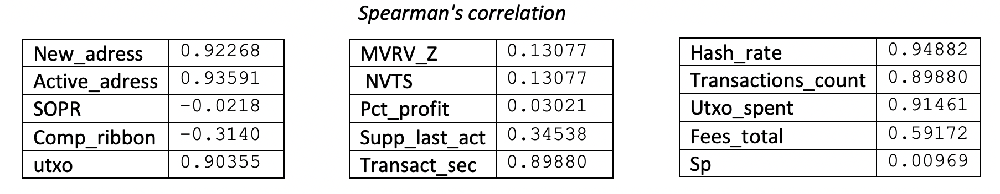

To begin with, we keep all the indicators that have a correlation higher than 0.8 over the whole period.

Moreover when we vary the periods we find interesting results for mvrv\_z, nvts, and pct\_profit, for example period (2016-03-09 - 2017-07-22) :

mvrv\_z 0.988369

nvts 0.929820

pct\_profit 0.892771

Our models will be trained by periods, which is why it seems judicious to keep these indicators which are effective over certain periods.

The correlation with the SP500 is non-existent. Over the whole period it seems normal to us, this potential correlation would have come only frequently with the democratization of Bitcoin, and the influx of institutional investors. However, even over the last 365 periods this correlation is almost non-existent. It has been concluded that Bitcoin reacts only to the SP500 crash, some investors must surely reduce their positions to make up for their losses, which creates a climate of doubt. Given the small number of time periods that can be assimilated to this pattern, in this research the addition of the SP500 would add more noise to the model than anything else.

We thus obtain the list of technical data that we will use as input for our models:

[&#39;new\_adress&#39;, &#39;sopr&#39;, &#39;utxo&#39;, &#39;transac\_sec&#39;, &#39;mvrv\_z&#39;, &#39;nvts&#39;, &#39;pct\_profit&#39;, &#39;active\_adress&#39;, &#39;hash\_rate&#39;, &#39;transactions\_count&#39;,&#39;utxo\_spent&#39;]

# Preprocessing &amp; Training Architecture

## preprocessing

### logarithmic transformation

As mentioned above, the evolution of prices is punctuated by major upward cycles. This implies much higher local highs, and orders of magnitude clearly different according to the periods, even relatively close. We thus perform a logarithmic transformation for our indicators, which are not bounded. Our multiplicative series becomes additive. This transformation does not replace the scaling that will be done later. It does not serve as a denoising that we will try to add to our models later.

### Scaling

We have dealt with different orders of magnitude for the same feature, we will now deal with different orders of magnitude between features so that the networks do not overweight the weights assigned to a feature that has a large order of magnitude. We will normalize all the variables so that their distributions are between 0 and 1. These calculations are performed to normalize each feature:

X\_std=(X-X.min/(X.max-X.min)

X\_scaled=X\_std\*(max-min)+min

We now have our set of 16 features scaled between 0 and 1.

## TRAINNING ARCHITECTURE

As mentioned above we will test the model for time depths 5,10,20,50. However, these are not the only parameters that we will vary. We are going to test our models according to different training and test periods.

We will test our models for 12 quarters, from November 2017 to .........

For each quarter the model applied will be trained either over the last 2 years or the last 3 years.

This gives us 12 training sets of 730 periods, for 12 corresponding test sets of 90 periods.

For the 2 years training this gives us 12 training sets of 1095 periods, for 12 corresponding test sets of 90 periods.

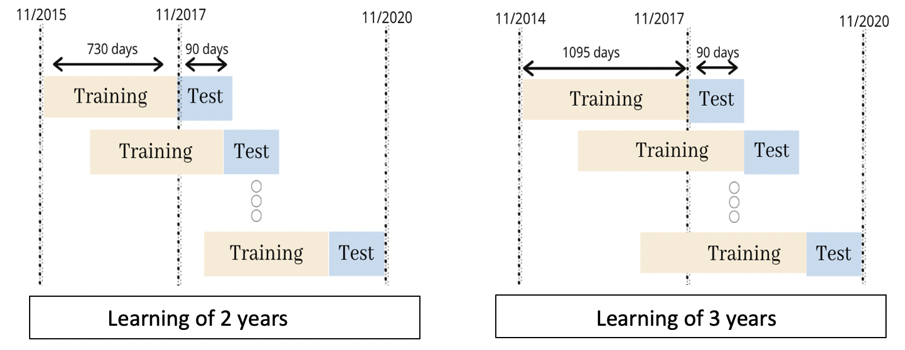

We started by performing split validation of 0.2 for the training set, adding an early\_stopping to our model that stopped learning our models when the accuracy of the validation set did not increase for 15 periods. However, we made the decision not to work like that anymore. The final goal of our research is to maximize the gains associated with these prediction models, accuracy is only an intermediate metric as important as it is. In many cases accuracy may not increase or even decrease, but our networks may be learning the patterns preceding the most important movements. In a small proportion of periods we find the majority of price movements. An accuracy of 30% may not be able to detect minor movements but will predict with conviction the periods representing 90% of the variance of a quarter.

In addition to varying the test and training periods, we will also vary the temporal horizon of our model. First, we will train our model to predict whether the next closing price will be higher or lower than the current price level. We train our model by setting Xt to yt+1. We take positions on the upside when our model predicts 1, we liquidate our positions or we do nothing if our model predicts 0.

Movements in financial prices are generally, and even more so for a less mature and therefore less liquid asset, erratic. One way to counteract this would be to calibrate our daily investments on models that are trained to predict a slightly more distant future than the next day. We decide to use a time horizon of 7, for our buying or selling decisions. We train our model by making Xt on yt+7. We take a position on the upside when our model predicts 1, we liquidate our positions or we do nothing if our model predicts 0.

Be careful, predictions and positions will still be made every day. We could use this model to predict the prices in a week, take a position, not touch anything and do the same thing again 1 week later. The risk in this configuration is that the environment can change in 1 week, especially for an asset that works by trend as we saw earlier. This seems unwise to us, and too great a risk of being counterintuitive. We therefore take positions every day following the predictions of the 1-week time horizon closing. We think that this can help us to ignore certain noises and capture the important market movements that represent 90% of the variance of this asset.

# Neural Networks

As mentioned earlier, here we need to use non-linear learning models to try to model the price movements . For this purpose, it seems to us judicious to use Artificial Neural Networks. Artificial neural networks belong to the domain of Deep Learning, a subcategory of Machine Learning.

We will use 2 different neural networks in this work, a DNN (deep neural network), and a LSTM (long short term memory).

Our 2 models are classification models, so they will be optimized to maximize their accuracy. The accuracy will be the percentage of model prediction equal to the test sample for the same period t, on the number of total prediction.

## DNN

A neural network is composed of an input layer, n hidden layer(s) and an output layer. Each hidden layer takes as input the output of the previous layer. Thus the first hidden layer will take in input the output of the input layer, and the 2nd hidden layer will take in input the output of the 1st hidden layer.

Each layer is composed of a defined number of Neurons. A neuron takes as input a vector 𝑋=(𝑥1,𝑥2,…,𝑥𝑛), which represents each output of the n neurons of the previous layer, so we can say that the Neurons are fully connected.

With this vector X as input the Neuron is then the concatenation of 2 elements:

- A linear combination of these inputs with the weights (wk)k, plus a bias b, then giving this output: ∑𝑛𝑘=1𝑤𝑘𝑥𝑘+𝑏

- The activation function f of this combination that adds non-linearity

Given the input X vector, the output of a neuron is therefore 𝑓(∑𝑛𝑘=1𝑤𝑘𝑥𝑘+𝑏).

Several activation functions are available for each layer of neurons, we will present later those we will use.

Diagram of a neuron layer, each neuron fully connected:

Our DNN will be composed of an input layer where the number of neurons will be equal to the temporal depth multiplied by the number of features. This number of neurons corresponds to the number of input features in our network.

After varying the number of hidden layers between 1 and 5, it turns out that a number greater than 2 hidden layers does not necessarily improve the learning of the network. So we choose 2 hidden layers of x and x/2 neurons (x being the product just seen above).

Two learning curves on 500 epochs, on the left that of a DNN with 1 hidden layer, on the right that of a DNN with 3 hidden layers :

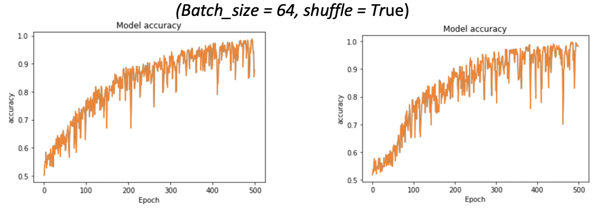

For our input and hidden layers we use the Relu activation function, Rectified Linear Unit ; f(x) = max(0,x).

It solves the problem of vanishing gradient descent, thanks to its linear behavior. It also allows to output values really equal to 0, unlike the Tanh and Sinh functions which output values close to 0, thus speeding up and simplifying the learning process and requiring less computational effort.

We then add our output layer to a connected neuron, to the outputs of the x/2 neurons of the previous layer. The activation function of this neuron will be Sigmoid and will limit our result between 0 and 1, representing the probability that the output of the model is equal to 1 (prices goes up).

To converge our networks towards the optimal solution, we use the extension of the stochastic gradient descent, ADAM (adaptive moment estimation). Introduced in 2015, by Diederik Kingma and Jimmy Ba, this allows us to have an efficient learning rate for non-stationary problems with a lot of noise like ours. The Optimizer will be used with the default values of the Keras library, ((lr=0.001, beta\_1=0.9, beta\_2=0.999, epsilon=1e-08, decay=0.0).

## LSTM

A sub-category of neural networks is the Recurent Neural Network, these networks have the particularity of including temporality in their calculations.

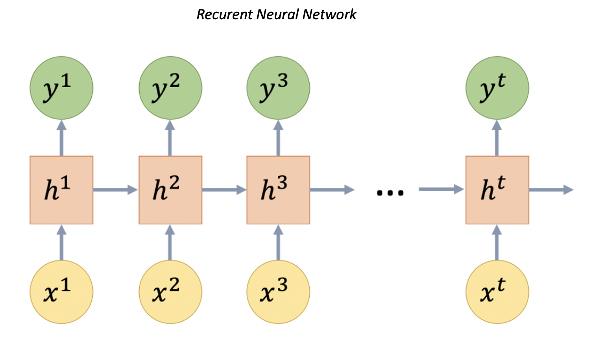

We have xt the input at time t, ht the hidden state at time t, and yt the output at time t. Thus a neural network recurent, not only uses an input x but also the hidden state at time t-1, to compute the hidden state at time t and then output y.

Let&#39;s imagine that we use a temporal depth of 5, the output of the model will be :

Y = 𝑤y\* h5+𝑏y , where h5 is the hidden state at time t = 5 and 𝑤y and 𝑏y are weights to be learned .

In our research we will use a particular model of RNN, the LSTM neurons. The problem of basic RNNs such as LSTM and GRU are a Vanishing Gradient problem. For long series, the stochastic gradient tends towards 0, and thus prevents the model from converging towards the global minimum. A Long Short Term Memory neuron compensates with a memory cell composed of a forget gate f i , an input gate i i , and an output gate o i at time step i .

La sortie d&#39;un réseau LSTM est calculé comme ceci :

_ft_ =_σ_(_Wfxt_+_Ufht_−1+_bf_)

_it_ =_σ_(_Wixt_+_Uiht_−1+_bi_)

_ot_ =_σ_(_Woxt_+_Uoht_−1+_bo_)
_gt_ = _tanh_(_Wgxt_ + _Ught_−1 + _bg_)

_ct_ = _ft_ ⊙_ct_−1 + _it_ ⊙_gt
 ht_ =_ot_⊙_tanh_(_ct_)

xt is the input vector, ft, it, ot, are the forget, input, and output gates, gt the activation input, ct the cell state vector, ht output vector of the LSTM unit.

Our input layer will be composed of a layer of n neurons, which corresponds to the n features of our inputs. Our input x will be a vector of the shape (n, time depth,), so each timestep will be processed independently by the network.

Following the same approach as for DNN, we test configurations between 1 and 5 hidden layers. We observe that a model with one hidden layer learns very well, and that adding layers does not seem to induce a better learning, on the contrary . Our model will therefore be composed of one hidden layer. In order to avoid or at least to limit overfitting, i.e., that our model learns too specifically movements that are specific to our training set, we add a dropout layer after our hidden layer. This layer will be followed by the output neuron, with sigmoid activation function.

# Result

Neural networks are a stochastic algorithm, meaning that the same algorithm trained on the same data can train a different model each time the code is run.

So each result is the average of 10 trainning

Our results will be compared to the 3 Baseline model computed, the first one being a buy and hold strategy, the second one being the logistic regression done on the basis of the day before and the last one the totally random prediction generation (average over 10 generations).

We will start by comparing the two models independently. We will identify the most efficient training periods for each time depth. We will then obtain the most efficient models for each model and compare them.

## Deep Neural Network

12-Quarter Cumulative Returns:

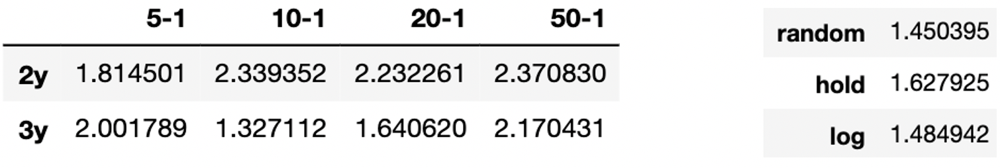

We can see that apart from our model of depth 10, for a 3-year learning, all these models outperform a simple buy and hold strategy and a logistic regression according to the previous day. All patterns based on the predictions of a deep neural network with a time horizon of 1 are superior to the returns generated by random investment choices.

Accuracy average of models over the 12 quarters :

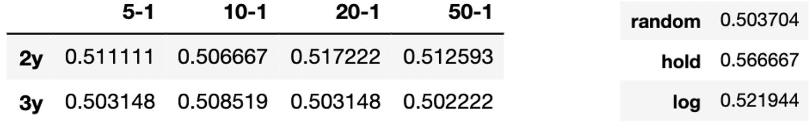

All our accuracies are less than the accuracy of a holding strategy and a simple logistical regression. They are of the order of random generation. This suggests that everything that has been learned by our models is just overfitting, and past price movements have nothing to do with future price movements.

Thus, the correlation between the returns of our models and the accuracy over our test period is not so obvious. The fact that we did not use early stopping seems to have been judicious, a low accuracy on a validation set does not mean that the model did not predict the most important movements, responsible for speculative performances.

We realize this by observing the results by quarter, we do this for example for the model of time depth 5 and time horizon 1 :

For 7 out of 12 periods, the Accuracy of our 3-year trained model is less than the accuracy of our 2-year trained model. For 8 out of 12 periods, the accuracy of the Random Model is higher than the accuracy of our 3-year trained Deep Neural Network. For 9 out of 12 periods, the accuracy of the logistic regression model is higher than the accuracy of our best performing model. The accuracy of our best performing model appears to be the lowest.

Recall

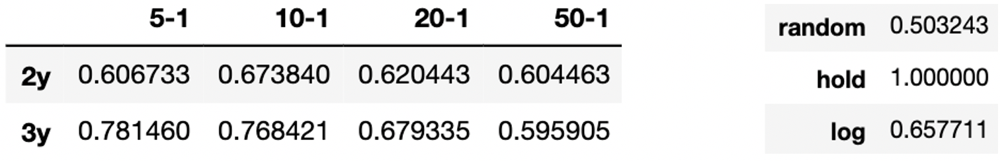

The recall rate goes up to 78.14% for a time depth of 5 trained on the prices of the last 2 years, this result is much higher than a random model and simple logistic regression. All these networks manage to predict a proportion of upward movements considerably higher than the randomly generated model. Knowing that it is very lucrative to position oneself in the direction of Bitcoin&#39;s major bull cycles, this seems to be a major advantage. However, the configurations with the highest recall rate are not necessarily the configurations with the highest rate of return.

Specificity :

The rate of specificity is lower than a random distribution, while being generally slightly higher than a simple logistic regression. The model predicts a higher proportion of upward movements than downward movements. There is a slight correlation between the rate of return and our specificity. These models would thus capture most of the upward movements that would respond to the profits of a hoding strategy, and the higher return would vary according to the configuration, depending on the proportion of price falls covered by the model.

Does increasing the time horizon of the Deep Neural Network increase accuracy or returns?

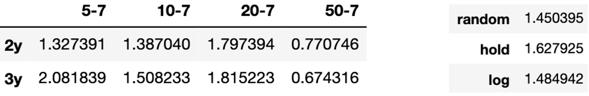

We can see that in the case of the Deep Neural Network, extending the time horizon to align with a more representative trend does not seem to work. Most of the models are below the total returns obtained when the model is fit on the next day. With particularly catastrophic results for a temporal depth of 50.

## LSTM

Accumulated return over the 12 quarters :

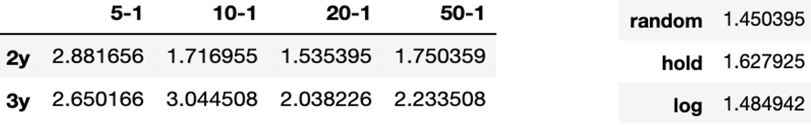

Regardless of the configuration Lstm&#39;s networks seem to outperform a purchasing strategy in the majority of cases. We observe very encouraging performances, notably for a time depth of 10 trained over 3 years which achieves 304.45% return over the 3 years, or 141.66% of surplus generated compared to a passive strategy. The addition of temporal depth does not seem to improve our network, even if the LSTM neurons are adapted to long time series.

We observe the returns by quarters for the 2 best performing configurations:

The distribution of revenues across the periods is very similar for our two high-performance models. These returns also tend to be correlated with the returns of a holding strategy. This comes from the fact that our LSTM networks tend to be more bullish than bearish like our DNN networks. When prices increase, our strategy performs similarly to a passive strategy. However, when prices fall, our strategy limits losses considerably. The major losses are made in quarters 3 and 5, during these quarters the prices fall respectively by 23.63% and 45.28%, while the strategy for the 5-1-2y model records losses of 6.83% and 20.33%.

ACCURACY

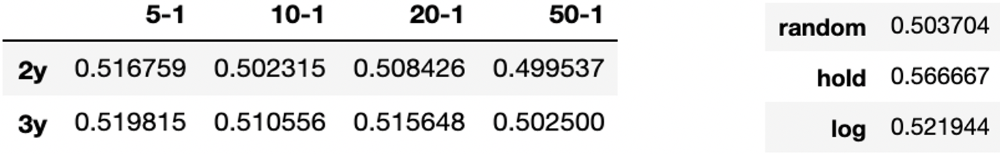

An accuracy that confirms what we saw earlier, with no statistically significant difference between the models and with a randomized model for this measure.

RECALL

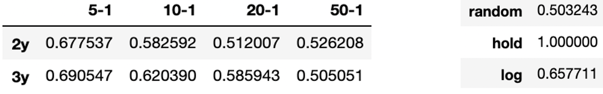

As with our DNN Networks, there is a statistically significant difference between our recall score and that for a random generation.

SPECIFICITY

We confirm what we mentioned above and that we had already abstained with our previous models. The specificity score is lower and our models tend to be bullish. Our models have a bullish bias that could play tricks on us when prices fall.

Does Extending the Time Horizon work for Our Long-Short-Term-memory Network?

We see that when we increase the time horizon to 7 periods it decreases the results. This superforms a purchasing strategy only for a time depth of 5, the returns are very low for a large time depth despite LSTM networks that are made for this.

Even if some models do not have a very strong cumulative performance, it may perform well in some quarters. The best-performing models do not necessarily perform well in all periods. We have therefore observed which models are the best performers in each period:

The results clearly show us that using past prices to predict future prices can yield additional returns. In both cases, the Strategies have returns that are far superior to a strategy of random buying. Thus, neural models are able to extract information from past prices that allows them to predict a large proportion of upward movements while still predicting some downward movements. We deduce from this the existence of certain market inefficiencies for the prices of Bitcoin. In the rest of this paper, we will try to optimize our most efficient network, based on a model already implemented on the traditional markets. [2] [3].

# DENOISING

The price of Bitcoin has erratic movements, and therefore causes a lot of noise. We believe that our models would perform better if we could remove noise from our inputs, as they would contain more useful information. A technique widely used in recent years for time series denoising is the Wavelet Transformation. Chan PMJ, Mehralizadeh M. use it as a complement to neural networks to try to predict future contracts of East Asian indices [2] Wei Bao, Jun Yue, Yulei Rao, also use it as a complement to neural networks to try to predict prices of 6 indices across the world, trying to represent mature, emerging and juvenile markets [3]. Khurshid Ahmad [10], shows in his paper that this method of denoising seems coherent to apply to economic and financial data. Some studies incorporate this transformation within the deep learning network [4].

Searches [2][3] don&#39;t stop there, they add another step to extract the main information from our features. The noiseless features will be passed in an autoencoder [2], while Chan PMJ, Mehralizadeh M. will use PCA size dimension reduction. We will test the following implementation on our best performing model and observe the results:

- Wavelet Transform

- Autoencoder

- Quadratic discriminant analysis (close to PCA)

-wavelet  Autoencoder

- wavelet  Quadratic discriminant analysis

## Wavelet transform

Wavelet Tranform is a signal extraction method, very similar to the famous Fourrier transformations.

There are several types of Wavelets, we use Haar as a basic function for our implementation [2]. We choose a Discrete Wavelet Transformation rather than a Continuous Transformation Wavelet, the sampling of the DWT is a way to avoid the redundancy of the CWT [2].

_ tranformation Scheme :_

 

In the figure, H, L and H &#39;, L&#39; are the high-pass and low-pass filters for wavelet decomposition and reconstruction respectively. In the decomposition phase, the low-pass filter removes the higher frequency components of the signal and the high-pass filter captures the remaining parts. Then, the filtered signals are subsampled by two and the results are called approximation coefficients and detail coefficients. Reconstruction is just an inverse process of decomposition and for a perfect reconstruction of the filter banks we have x = x &#39;. We choose to apply the transformation on all our features .

## QDA

After this price transformation we can go even further to give the best possible information to our network. We will implement the 2 following methods:

- Quadratic Discriminant Analysis, an alternative to Random Component Analysis, more adapted to a classification problem, an unsupervised algorithm for identifying variance dimensions. Unlike PCA, we consider here different covariance matrices for the different classes of our classification.

- Autoencoder [2], a hidden 3-layer neural network that is supposed to remove noise and extract the essential information present in our features. The input of our neural network will be n features and the output will be n new features. Our trained X and our target are the same for our autoencoder, these are the features.

##

# Result

Our new Benchmarck will therefore be the results of our best model:

Results of Wavelet Transform :

Although for a few quarters the performance is better when de-noising features to models, the performance of our base model seems to be better. We obtain a total profitability of 180.56%, with the implementation of a wavelet transform. This represents a loss of 123.89% compared to our benchmark. Even if this performance remains superior to a passive strategy, this loss of profitability leads us to believe that the denoising of features makes us lose too much information on their movements. We won&#39;t cover this in this research but it would be interesting to denoise the features one by one and observe the result. Except for periods 6 and 7, the recall is lower than the benchmark. It seems that feature denoising mostly causes less frequent accurate upside predictions, which is what gives our models their strength.

These performances are confirmed even when an encoder or quadratic discriminant analysis is added. We obtain a total efficiency of 140.91% when we perform a wavelet transformation and then an encoder to our features, and 131.11% when we use a quadratic discriminant analysis.

These combined procedures seem to lead to an even greater loss of information.

AutoEncoder :

The results are similar with, but lower, large yield variances over the first two quarters, resulting in returns of 202.81% for our network with encoder, or 101.54% less than for our network without encoder.

Even if the efficiency is slightly higher in some quarters, these results lead us to believe that encoding our features does not add any additional value to the inputs of our network.

QDA :

With a Total Efficiency of 166.51%, we come to the same conclusion as for encoding or Wavelet Transformation, these processes remove important information for the prediction of future movements.

Thus, methods used in traditional markets do not seem to work for our asset. However, there is no denying the presence of significant noise in our features, a more in-depth study of a denoising method that would work on Bitcoin could give us a lot of accuracy and performance. As we said before, it would be desirable to carry out this study for each feature independently of each other.

# CONCLUSION

We have proven that neural networks are capable of generating a consistent superior performance using past historical information. This includes strong evidence of the presence of market inefficiencies for Bitcoin&#39;s assets, and therefore surely for the entire crypto-cash market. It has also been observed that higher returns do not always correspond to higher accuracy, the majority of the movements are minimal, and only a small proportion is of interest to us. However this was only an exploratory study, these models are in my opinion not mature enough to be implemented in real life. A lot of work remains to be done. The denoising of the time series that we give as input to our model is still a grey area. It has been mentioned that the social fabric is very important for this asset [6], but none of our features reflect the market sentiment. Many tools can be used to do this, one search observes correlations between the price of Bitcoin, the google trends search curve of the term &#39;Bitcoin&#39; and the volume of positive tweets about this asset [9]. As we have seen in the [result] section, learning takes place over the last 2 or 3 years, these periods usually encompass a considerable number of patterns. However, if similar periods could be identified, would it not be better to train the patterns over the period following the past similar period .
